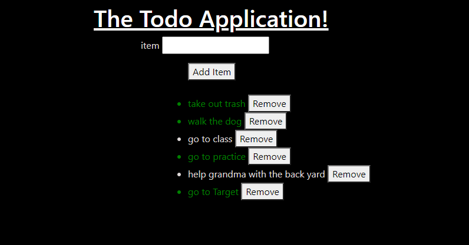

# javaScript105
## JS To Do Application

> Dynamic Elements, Retrieving Values, Timed Events, and a JS Review
- - -

***To Do Application***

```
For this assignment we created a JavaScript To Do Application
Given a To Do task
THEN we will save it to the To Do List Items
GIVEN task isDone
THEN a user can change it to GREEN
GIVEN the choice to remove the task entirely 
THEN a user can remove item from list

```



## LINKS

- [javaScript105 Link] Coming Soon!
- [Github Repo Link](https://github.com/nicholasd-uci/javaScript105)

- - -
© 2020 NPRD, Nicholas Paul Ruiz Dallas